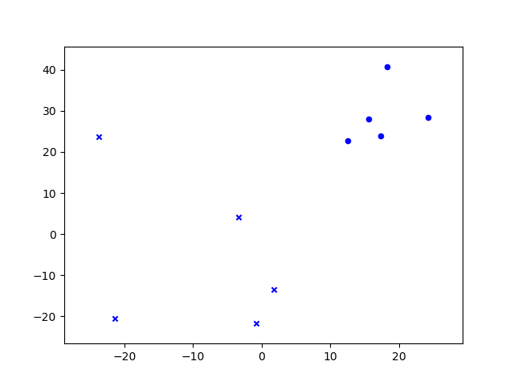
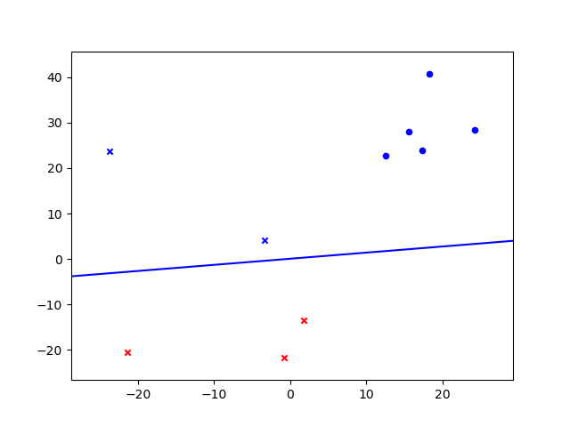
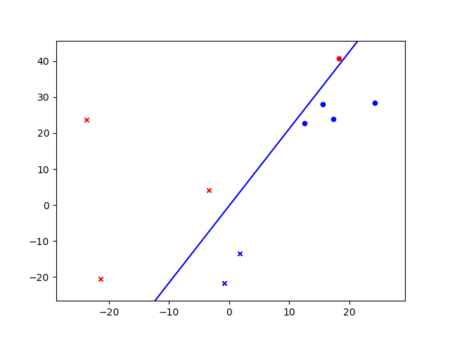
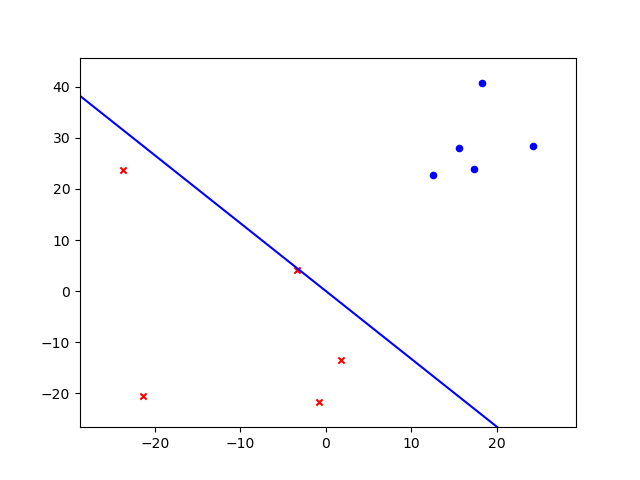

# Perceptron-Learning-Algorithm

## The format of input.txt
  x1, x2, y
  
  x1, x2, y
  
  x1, x2, y
  
  .
  
  .
  
  .
  
## Algorithm
  - Initialize W by zero.
  - If find any Xn such that sign(W ‧ Xn) != sign(Yn), then update W = W + Yn*Xn.
  - If no more mistakes, return the last W.
  - To avoid infinite loop, I set the maximum number of loops of 100.
  
  
## Demo
  - w0: -1.0
  - w1: 40.3
  - w2: 30.400000000000006
  ---
  
  
  
  
 
